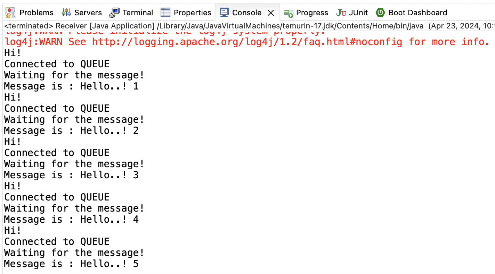

# JMS-ActiveMQ

Simple JMS application that places messages on a queue in ActiveMQ and consumes messages from the queue immediately after.

### Environment Setup: 
1. Start ActiveMQ 6.1.1 broker
```
bin# activemq start
```
2. ActiveMQ Admin Console is available at http://localhost:8161/

## DEMO 1: P2P Example
1. Run Sender.java, observe DEMOQUEUE in the Admin Console, 7 messages are sent as seen in the console


2. Run Receiver.java, observe 5 out of 7 messages are dequeued by the consumer



## DEMO 2: P2P Example with thread
See ReceiverThreads.java for details

## DEMO 3: Pub-Sub Example
1. Run consumer.java and consumer2.java, observe 2 consumers are available for topic "testt"


2. Run producer.java, observer 1 message is enqueued and both consumers have received that message


